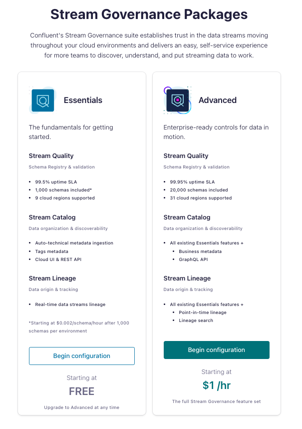
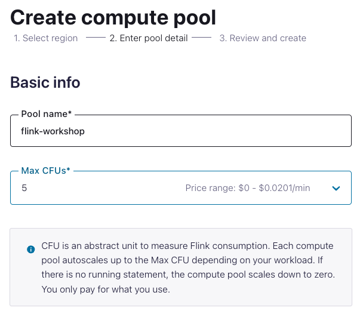
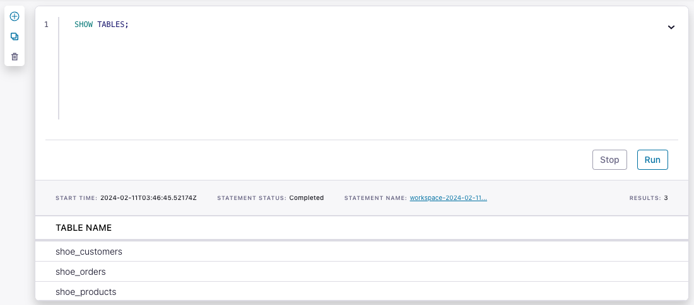
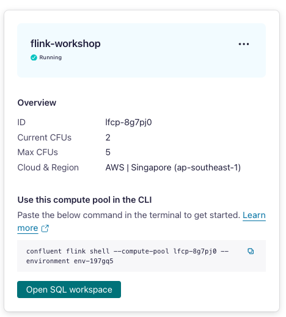

<div align="center" padding=25px>
    
</div>

# <div align="center">Enable Real-Time Data Transformations and Stream Processing with Apache Flink on Confluent Cloud</div>
## <div align="center">Lab Guide</div>
<br>

## **Agenda**
1. [Log into Confluent Cloud](#step-1)
2. [Create an Environment and Cluster](#step-2)
3. [Create Flink Compute Pool & ksqlDB](#step-3)
4. [Create Topics and walk through Confluent Cloud Dashboard](#step-4)
5. [Create an API Key Pair](#step-5)
6. [Create Datagen Connectors for Machine Data](#step-6)
7. [Flink Windowing and Aggregations](#step-7)
8. [Flink Joins for Triggered Alarm](#step-8)
9. [Flink Monitoring](#step-9)
10. [Clean Up Resources](#step-10)
11. [Confluent Resources and Further Testing](#step-11)

***

## **Prerequisites**
<br>

1. Create a Confluent Cloud Account.
    - Sign up for a Confluent Cloud account [here](https://www.confluent.io/confluent-cloud/tryfree/).
    - Once you have signed up and logged in, click on the menu icon at the upper right hand corner, click on “Billing & payment”, then enter payment details under “Payment details & contacts”. A screenshot of the billing UI is included below.

> **Note:** You will create resources during this workshop that will incur costs. When you sign up for a Confluent Cloud account, you will get free credits to use in Confluent Cloud. This will cover the cost of resources created during the workshop. More details on the specifics can be found [here](https://www.confluent.io/confluent-cloud/tryfree/).

<div align="center" padding=25px>
    
</div>

***

## **Objective**

<br>

Welcome to “Enable Real-Time Data Transformations and Stream Processing with Apache Flink on Confluent Cloud”! In this workshop, you will learn how to build stream processing applications using Apache Flink on Confluent Cloud as well as learn about the use cases Apache Flink unlocks: streaming ETL, data discovery and enrichment, anomaly detection, and more.

In this workshop, you will have learned how to leverage Apache Flink to perform continuous transformations, create materialized views, and serve lookups against these materialized views all with the data you already have in Confluent Cloud.

***


## <a name="step-1"></a>Log into Confluent Cloud

1. Log into [Confluent Cloud](https://confluent.cloud) and enter your email and password.

<div align="center" padding=25px>
    
</div>

2. If you are logging in for the first time, you will see a self-guided wizard that walks you through spinning up a cluster. Please minimize this as you will walk through those steps in this workshop. 

***

## <a name="step-2"></a>Create an Environment and Cluster

An environment contains clusters and its deployed components such as Apache Flink, Connectors, ksqlDB, and Schema Registry. You have the ability to create different environments based on your company's requirements. For example, you can use environments to separate Development/Testing, Pre-Production, and Production clusters. 

1. Click **+ Add Environment**. Specify an **Environment Name** and Click **Create**. 

>**Note:** There is a *default* environment ready in your account upon account creation. You can use this *default* environment for the purpose of this workshop if you do not wish to create an additional environment.

<div align="center" padding=25px>
    
</div>

2. Select **Essentials** for Stream Governance Packages, click **Begin configuration**.

<div align="center" padding=25px>
    
</div>

3. Select **AWS Sydney Region** for Stream Governance Essentials, click **Continue**.

<div align="center" padding=25px>
    
</div>

4. Now that you have an environment, click **Create Cluster**. 

> **Note:** Confluent Cloud clusters are available in 3 types: Basic, Standard, and Dedicated. Basic is intended for development use cases so you will use that for the workshop. Basic clusters only support single zone availability. Standard and Dedicated clusters are intended for production use and support Multi-zone deployments. If you are interested in learning more about the different types of clusters and their associated features and limits, refer to this [documentation](https://docs.confluent.io/current/cloud/clusters/cluster-types.html).

5. Chose the **Basic** cluster type. 

<div align="center" padding=25px>
    
</div>

6. Click **Begin Configuration**. 
7. Choose your preferred Cloud Provider (AWS, GCP, or Azure), **singapore region**, and availability zone. 
8. Specify a **Cluster Name**. For the purpose of this lab, any name will work here. 

<div align="center" padding=25px>
    
</div>

9. View the associated *Configuration & Cost*, *Usage Limits*, and *Uptime SLA* information before launching. 
10. Click **Launch Cluster**. 

***

## <a name="step-3"></a>Create a Flink Compute Pool

<details>
    <summary><b>Flink</b></summary>
1. On the navigation menu, select **Flink** and click **Create Compute Pool**.

<div align="center" padding=25px>
    
</div>

2. Select **Singapore region** and then **Continue**.
<div align="center" padding=25px>
    
</div>

3. Name you Pool Name and set the capacity units (CFUs) to **5**. Click **Finish**.

<div align="center" padding=25px>
    
</div>

> **Note:** The capacity of a compute pool is measured in CFUs. Compute pools expand and shrink automatically based on the resources required by the statements using them. A compute pool without any running statements scale down to zero. The maximum size of a compute pool is configured during creation. 

4. Flink Compute pools will be ready shortly. You can click **Open SQL workspace** when the pool is ready to use.

<div align="center" padding=25px>
    
</div>

5. Change your workspace name by clicking **settings button**. Click **Save changes** after you update the workspace name.

<div align="center" padding=25px>
    
</div>

6. Set the default Catalog as your environment name.

<div align="center" padding=25px>
    
</div>

7. Set the default Database as your cluster name.

<div align="center" padding=25px>
    
</div>

</details>
<br>

<details>
    <summary><b>ksqlDB</b></summary>
1. On the navigation menu, select **ksqlDB** and click **Create Application Myself**. 
2. Select **Global Access** and then **Continue**.
3. Name you ksqlDB application and set the streaming units to **4**. Click **Launch Application!**

> **Note:** A Confluent Streaming Unit is the unit of pricing for Confluent Cloud ksqlDB. A CSU is an abstract unit that represents the size of your kSQL cluster and scales linearly. 

<div align="center" padding=25px>
    
</div>

</details>
<br>
***

## <a name="step-4"></a>Creates Topic and Walk Through Cloud Dashboard

1. On the navigation menu, you will see **Cluster Overview**. 

> **Note:** This section shows Cluster Metrics, such as Throughput and Storage. This page also shows the number of Topics, Partitions, Connectors, and ksqlDB Applications.  Below is an example of the metrics dashboard once you have data flowing through Confluent Cloud. 

<div align="center" padding=25px>
    
</div>

2. Click on **Cluster Settings**. This is where you can find your *Cluster ID, Bootstrap Server, Cloud Details, Cluster Type,* and *Capacity Limits*.
3. On the same navigation menu, select **Topics** and click **Create Topic**. 
4. Enter **machine_stream** as the topic name, **1** as the number of partitions, and then click **Create with defaults**. 

<div align="center" padding=25px>
    
</div>

> **Note:** Topics have many configurable parameters. A complete list of those configurations for Confluent Cloud can be found [here](https://docs.confluent.io/cloud/current/using/broker-config.html). If you are interested in viewing the default configurations, you can view them in the Topic Summary on the right side. 

5. After topic creation, the **Topics UI** allows you to monitor production and consumption throughput metrics and the configuration parameters for your topics. When you begin sending messages to Confluent Cloud, you will be able to view those messages and message schemas.

6. Below is a look at the topic, **machine_stream**, but you need to send data to this topic before you see any metrics.

<div align="center" padding=25px>
    
</div>

***

## <a name="step-5"></a>Create an API Key

1. Click **API Keys** on the navigation menu. 
2. Click **Create Key** in order to create your first API Key. If you have an existing API Key select **+ Add Key** to create another API Key.

<div align="center" padding=25px>
    
</div>

3. Select **Global Access** and then click **Next**. 
4. Copy or save your API Key and Secret somewhere. You will need these later on in the lab, you will not be able to view the secret again once you close this dialogue. 
5. After creating and saving the API key, you will see this API key in the Confluent Cloud UI in the **API Keys** section. If you don’t see the API key populate right away, refresh the browser.

***

## <a name="step-6"></a>Create Datagen Connectors for Customers, Products and Orders

The next step is to produce sample data using the Datagen Source connector. You will create one custom Datagen Source connectors. The connector will send sample customer data to **machine_stream** topic.

1. Create the connector that will send data to **machine_stream**. From the Confluent Cloud UI, click on the **Connectors** tab on the navigation menu. Click on the **Datagen Source** icon.

<div align="center" padding=25px>
    
</div>

2. Enter the following configuration details. The remaining fields can be left blank.

<div align="center">

| setting                            | value                        |
|------------------------------------|------------------------------|
| name                               | DatagenSourceConnector_machinestream |
| api key                            | [*from step 5* ](#step-5)    |
| api secret                         | [*from step 5* ](#step-5)    |
| topic                              | machine_stream               |
| output message format              | AVRO                         |
| max interval between messages (ms) | 1000                         |
| tasks                              | 1                            |
</div>

<br>

<div align="center" padding=25px>
    
    
</div>

Copy this JSON-encoded Avro Schema for the data generator
```bash
{
        "namespace": "ksql",
        "name": "machine_control",
        "type": "record",
        "fields": [
                {"name": "machineid", "type": {
                    "type": "string",
                    "arg.properties": {
                        "options": [
                        "Machine_1",
                        "Machine_2",
                        "Machine_3",
                        "Machine_4",
                        "Machine_5",
                        "Machine_6",
                        "Machine_7",
                        "Machine_8",
                        "Machine_9",
                        "Machine_10"
            ]
           }
                }},
                {"name": "log_code_return", "type": {
                    "type": "string",
                    "arg.properties": {
                      "options": [
                        "401",
                        "402",
                        "403",
                        "404",
                        "405",
                        "200",
                        "500"
                      ]
                    }
                }},
                {"name": "door_status", "type": {
                    "type": "string",
                    "arg.properties": {
                        "options": [
                            "OPEN",
                            "CLOSED"
                        ]
                    }
                }},
                {"name": "power_status", "type": {
                    "type": "string",
                    "arg.properties": {
                        "options": [
                            "STABLE",
                            "FLICKER",
                            "DOWN"
                        ]
                    }
                }}
        ]
}
```

3. Click on **Show advanced configurations** and complete the necessary fields and click **Continue**.

<div align="center" padding=25px>
    
</div>
   
4. Before launching the connector, you should see something similar to the following. If everything looks similar, select **Launch**. 

<div align="center" padding=25px>
    
</div>

> **Note:** It may take a few moments for the connectors to launch. Check the status and when both are ready, the status should show *running*. <br> <div align="center"></div>

> **Note:** If the connectors fails, there are a few different ways to troubleshoot the error:
> * Click on the *Connector Name*. You will see a play and pause button on this page. Click on the play button.
> * Click on the *Connector Name*, go to *Settings*, and re-enter your API key and secret. Double check there are no extra spaces at the beginning or end of the key and secret that you may have accidentally copied and pasted.
> * If neither of these steps work, try creating another Datagen connector.


5. You can view the sample data flowing into topics in real time. Navigate to  the **Topics** tab and then click on the **machine_stream**. You can view the production and consumption throughput metrics here.

6. Click on **Messages**.

* You should now be able to see the messages within the UI. You can view the specific messages by clicking the icon. 

<div align="center">
    
</div> 

* The message details should look something like the following. 

<div align="center">
    
</div>

***

## <a name="step-7"></a>Flink/ksqlDB Windowing and Aggregations
Kafka topics and schemas are always in sync with our Flink cluster. Any topic created in Kafka is visible directly as a table in Flink, and any table created in Flink is visible as a topic in Kafka. Effectively, Flink provides a SQL interface on top of Confluent Cloud.

<details>
    <summary><b>Flink</b></summary>
Following mappings exist:
| Kafka          | Flink     | 
| ------------   | --------- |
| Environment    | Catalog   | 
| Cluster        | Database  |
| Topic + Schema | Table     |

1. Familiarize with **Flink SQL** Basics.
```sql
SHOW CATALOGS;
```

```
SHOW DATABASES;
```

```sql
SHOW TABLES;
```
<div align="center">
    
</div>

Understand how the table `machine_stream` was created:

```sql
SHOW CREATE TABLE machine_stream;
```

You can find more information about all DDL Statements [here.](https://docs.confluent.io/cloud/current/flink/reference/statements/overview.html)

Let us first check the table schema for our `machine_stream` catalog. This should be the same as the topic schema in Schema Registry.
```sql
DESCRIBE machine_stream;
```

2. Let's check if any product records exist in the table.
```sql
SELECT * FROM machine_stream;
```

3. Create table for three parameter that will be aggregate on independent window frame.
power_status_counts
```sql
CREATE TABLE door_status_counts (
  machineid STRING,
  power_status_count BIGINT,
  window_start TIMESTAMP,
  window_end TIMESTAMP
)
```

door_status_counts
```sql
CREATE TABLE door_status_counts (
  machineid STRING,
  door_status_count BIGINT,
  window_start TIMESTAMP,
  window_end TIMESTAMP
)
```

log_status_counts
```sql
CREATE TABLE door_status_counts (
  machineid STRING,
  log_status_count BIGINT,
  window_start TIMESTAMP,
  window_end TIMESTAMP
)
```

4. Insert the data to the created table in window frame for every parameter

power_status_counts
```sql
INSERT INTO power_status_counts(
  machineid,
  power_status_count,
  window_start,
  window_end
  )
SELECT 
  machineid,
  COUNT(power_status) AS power_status_count,
  window_start,
  window_end
FROM TABLE(
  HOP(TABLE stream_processing, DESCRIPTOR(`$rowtime`), INTERVAL '5' MINUTES, INTERVAL '10' MINUTES))
  WHERE power_status='DOWN'
  group by machineid, window_start, window_end;
```

door_status_counts
```sql
INSERT INTO door_status_counts(
  machineid,
  door_status_count,
  window_start,
  window_end
  )
SELECT 
  machineid,
  COUNT(door_status) AS door_status_count,
  window_start,
  window_end
FROM TABLE(
  HOP(TABLE machine_topic, DESCRIPTOR(`$rowtime`), INTERVAL '5' MINUTES, INTERVAL '10' MINUTES))
  WHERE door_status='OPEN'
  group by machineid, window_start, window_end;
```

log_status_counts
```sql
INSERT INTO log_status_counts(
  machineid,
  log_status_count,
  window_start,
  window_end
  )
SELECT 
  machineid,
  COUNT(log_code_return) AS door_status_count,
  window_start,
  window_end
FROM TABLE(
  HOP(TABLE machine_topic, DESCRIPTOR(`$rowtime`), INTERVAL '5' MINUTES, INTERVAL '10' MINUTES))
  WHERE log_code_return='500'
  group by machineid, window_start, window_end;
```
</details>
<br>

<details>
    <summary><b>ksqlDB</b></summary>
1. Create Stream over the Machine Topic
```sql
CREATE STREAM MACHINE 
(machineid STRING, 
log_code_return STRING, 
door_status STRING, 
power_status STRING) 
WITH (KAFKA_TOPIC='machine_topic', VALUE_FORMAT='AVRO');
```

2. Create The Window frame to aggregate the data for three parameters
power_status_count
```sql
CREATE TABLE ksql_power_status_count WITH (KAFKA_TOPIC='power_status_counts'), VALUE_FORMAT='AVRO') 
AS SELECT
machineid,
AS_VALUE(machineid) AS machine_id, 
COUNT(power_status) AS power_counts,
TIMESTAMPTOSTRING(WINDOWSTART, 'yyyy-MM-dd HH:mm:ss Z') AS WINDOW_START,
TIMESTAMPTOSTRING(WINDOWEND, 'yyyy-MM-dd HH:mm:ss Z') AS WINDOW_END
  FROM machine
  WINDOW HOPPING (SIZE 10 MINUTES, ADVANCE BY 5 MINUTES)
  WHERE power_status='DOWN'
  GROUP BY machineid,
  EMIT CHANGES;
```

door_status_count
```sql
CREATE TABLE ksql_door_status_count WITH (KAFKA_TOPIC='door_status_counts'), VALUE_FORMAT='AVRO') 
AS SELECT
machineid,
AS_VALUE(machineid) AS machine_id, 
COUNT(door_status) AS door_counts,
TIMESTAMPTOSTRING(WINDOWSTART, 'yyyy-MM-dd HH:mm:ss Z') AS WINDOW_START,
TIMESTAMPTOSTRING(WINDOWEND, 'yyyy-MM-dd HH:mm:ss Z') AS WINDOW_END
  FROM machine
  WINDOW HOPPING (SIZE 10 MINUTES, ADVANCE BY 5 MINUTES)
  WHERE door_status='OPEN'
  GROUP BY machineid,
  EMIT CHANGES;
```

log_status_count
```sql
CREATE TABLE ksql_log_status_count WITH (KAFKA_TOPIC='log_status_counts'), VALUE_FORMAT='AVRO') 
AS SELECT
machineid,
AS_VALUE(machineid) AS machine_id, 
COUNT(log_code_return) AS log_counts,
TIMESTAMPTOSTRING(WINDOWSTART, 'yyyy-MM-dd HH:mm:ss Z') AS WINDOW_START,
TIMESTAMPTOSTRING(WINDOWEND, 'yyyy-MM-dd HH:mm:ss Z') AS WINDOW_END
  FROM machine
  WINDOW HOPPING (SIZE 10 MINUTES, ADVANCE BY 5 MINUTES)
  WHERE log_code_return='500'
  GROUP BY machineid,
  EMIT CHANGES;
```

</details>
<br>

***

## <a name="step-8"></a>Flink Joins
Flink supports complex and flexible join operations over dynamic tables. There are a number of different types of joins to account for the wide variety of semantics that queries may require.

By default, the order of joins is not optimized. Tables are joined in the order in which they are specified in the FROM clause.

You can tweak the performance of your join queries, by listing the tables with the lowest update frequency first and the tables with the highest update frequency last. Make sure to specify tables in an order that doesn’t yield a cross join (Cartesian product), which aren’t supported and would cause a query to fail.
For more details please check this [link.](https://docs.confluent.io/cloud/current/flink/reference/queries/joins.html)

1. Create table for Alarm Triggered.
```sql
CREATE TABLE alarm_trigger_machine(
machineid STRING,
log_status_count BIGINT,
door_status_count BIGINT,
power_status_count BIGINT,
window_start TIMESTAMP,
window_end TIMESTAMP);
```

2. Join three table that has been created to get flag by rules into single topic.
 
```sql
INSERT INTO alarm_trigger_machine(
  machineid,
  log_status_count,
  door_status_count,
  power_status_count,
  window_start,
  window_end
  )
SELECT 
  l.machineid, l.log_status_count, d.door_status_count, p.power_status_count, l.window_start, l.window_end
FROM log_status_counts l
INNER JOIN door_status_counts AS d ON l.window_start=d.window_start AND l.machineid=d.machineid
INNER JOIN power_status_counts AS p ON l.window_start=p.window_start AND l.machineid=p.machineid
WHERE log_status_count>0 AND door_status_count>0 AND power_status_count>0;
```


***

## <a name="step-9"></a>Flink Monitoring
1. Status of all the Flink Jobs is available under **Flink Statements** Tab.
   
<div align="center">
    
</div>

2. Compute pool utilization is available by clicking **Compute Pool tile**.

<div align="center">
    
</div>

3. Utilization information.

<div align="center">
    
</div>

<br> 


***

## <a name="step-10"></a>Clean Up Resources

Deleting the resources you created during this workshop will prevent you from incurring additional charges. 

1. The first item to delete is the Apache Flink Compute Pool. Select the **Delete** button under **Actions** and enter the **Application Name** to confirm the deletion. 

<div align="center">
    
</div>

2. Next, delete the Datagen Source connectors for **machine_stream**. Navigate to the **Connectors** tab and select each connector. In the settings tab, you will see a **trash** icon on the bottom of the page. Click the icon and enter the **Connector Name**.

<div align="center">
    
</div>


3. Delete the ksqlDB Cluster. On the Navigation menu click ksqlDB and select **DELETE** on to terminate the ksqlDB Cluster.


4. Finally, under **Cluster Settings**, select the **Delete Cluster** button at the bottom. Enter the **Cluster Name** and select **Confirm**. 

<div align="center">
    
</div>

*** 

## <a name="step-11"></a>Confluent Resources and Further Testing

Here are some links to check out if you are interested in further testing:
- [Confluent Cloud Documentation](https://docs.confluent.io/cloud/current/overview.html)
- [Apache Flink 101](https://developer.confluent.io/courses/apache-flink/intro/)
- [Stream Processing with Confluent Cloud for Apache Flink](https://docs.confluent.io/cloud/current/flink/index.html)
- [Flink SQL Reference](https://docs.confluent.io/cloud/current/flink/reference/overview.html)
- [Flink SQL Functions](https://docs.confluent.io/cloud/current/flink/reference/functions/overview.html)

***
